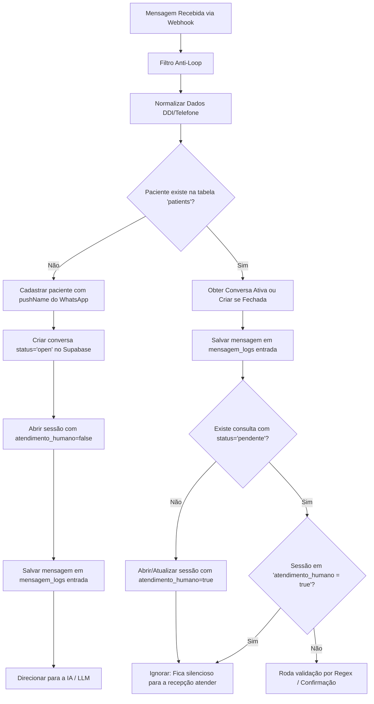

# Especificação de Design: Recepção Robusta, Histórico de Chat e Agendamento via IA (RAG)

**Data**: 18 de Junho de 2026  
**Status**: Proposto  
**Autor**: Antigravity

---

## 1. Visão Geral do Objetivo

Esta especificação define a arquitetura técnica e as alterações necessárias para tornar a recepção e o atendimento de pacientes no Cliniflow robustos e integrados. Focamos em três perfis:
1.  **Novos Pacientes**: Entrarão em um fluxo automatizado via IA Conversacional (LLM Gemini + RAG) para esclarecer dúvidas e realizar pré-agendamentos.
2.  **Pacientes Recorrentes em Confirmação**: Seguem no fluxo estruturado (Regex) de confirmação e cancelamento baseado em templates de lembretes.
3.  **Pacientes Recorrentes em Contato Espontâneo/Dúvidas**: Serão direcionados imediatamente para atendimento humano na fila do CRM, com o bot silenciado.

Além disso, passaremos a salvar **todo o histórico de mensagens** (tanto as recebidas do paciente quanto as automáticas enviadas pela IA ou Regex) na tabela `mensagem_logs` do Supabase, garantindo que a secretária veja no painel exatamente o mesmo histórico de chat do WhatsApp.

---

## 2. Decisões do Usuário & Regras de Negócio

Durante o processo de alinhamento (/grill-me), as seguintes regras foram estabelecidas:
*   **Definição de Recorrência**: Um paciente é considerado **Recorrente** se o seu número já estiver registrado na tabela `patients` (mesmo que nunca tenha agendado). Se não estiver cadastrado, é considerado **Novo** e passa pelo robô com LLM.
*   **Pausa Automática da IA/Automação**: Sempre que o atendente humano digitar e enviar uma mensagem manual pelo CRM (Cliniflow) para um paciente que esteja em um fluxo automatizado (seja de novos com IA, seja de recorrentes em confirmação com Regex), a automação correspondente é pausada para a sessão ativa (atualiza `sessoes_ativas.atendimento_humano = true`).
*   **Persistência da Pausa da IA/Automação**: O silenciamento por atendimento humano da sessão ativa não expira automaticamente (diferente das 16 horas padrão). A automação (IA ou Regex) ficará desativada para o paciente até que a secretária resolva a conversa no CRM (atualizando `conversations.status = 'resolved'`). Para pacientes recorrentes que entram em contato espontaneamente, o bot já é inicializado pausado (`atendimento_humano = true`), logo o comportamento é o mesmo.
*   **Associação de Clínicas**: O webhook do n8n identificará a qual clínica o paciente pertence associando a variável `instance` vinda da Evolution API com a tabela `clinics` (campo `evolution_instance`).
*   **Pré-Agendamento via IA**: A IA coletará especialidade, período/data preferencial e observações e inserirá uma solicitação na tabela `consultas` com `status = 'solicitado'`, alertando visualmente a secretária no painel.

---

## 3. Arquitetura do Sistema e Fluxo de Dados

O fluxo de dados no n8n para tratamento de webhooks de entrada seguirá a seguinte ordem:



---

## 4. Projeto dos Componentes Técnicos

### A. Banco de Dados (Supabase - SQL)
1.  **Status `'solicitado'` para consultas**:
    O campo `consultas.status` receberá o valor `'solicitado'` para pré-agendamentos da IA. Nenhum ajuste de CONSTRAINT é necessário pois o campo é do tipo `text`.
2.  **Políticas RLS**:
    Garantir que as tabelas `mensagem_logs`, `conversations` e `patients` tenham permissões adequadas para leitura/escrita do n8n via chamadas anonimizadas ou service_role, conforme definido em [fix_rls.sql](file:///c:/Users/Remute/Desktop/Software%20Cl%C3%ADnicas/scratch/fix_rls.sql).
3.  **RAG e Vetores**:
    A tabela `documentos_clinica` com 3072 dimensões será populada dividindo o arquivo [base_conhecimento_clinica.md](file:///c:/Users/Remute/Desktop/Software%20Cl%C3%ADnicas/base_conhecimento_clinica.md) nas seções demarcadas por `---`. Os embeddings serão calculados em 3072 dimensões.

### B. Automação (n8n Webhook Inbound)
1.  **Nó de Roteamento de Entrada**:
    Substituir o fluxo inicial para verificar se o paciente existe. Se não existir, insere-o, abre a conversa e a sessão, e segue para a LLM.
2.  **Nó AI Agent (Gemini)**:
    Configurar o nó `AI Agent` de LangChain:
    *   **Model**: Google Gemini (`models/gemini-2.5-pro` ou similar).
    *   **Memory**: `Postgres Chat Memory` configurado com `Session ID` = telefone do paciente.
    *   **Tool - RAG**: Nó `Consulta na database` (Supabase Vector Store) chamando a RPC `match_documentos_clinica`.
    *   **Tool - Pré-Agendamento**: Custom Tool escrita em JS no n8n.
        *   **Nome**: `criar_pre_agendamento`
        *   **Schema**:
            ```json
            {
              "type": "object",
              "properties": {
                "especialidade": { "type": "string", "description": "Ex: Botox, Limpeza de Pele" },
                "periodo_preferencia": { "type": "string", "description": "Ex: Segunda à tarde, Manhã" },
                "observacoes": { "type": "string", "description": "Notas adicionais do paciente" }
              },
              "required": ["especialidade", "periodo_preferencia"]
            }
            ```
        *   **Código**: Insere um registro em `consultas` com `status = 'solicitado'`, data de amanhã como padrão, e as notas do paciente.
3.  **Logs de Resposta**:
    Sempre que a IA ou a Regex enviar uma resposta pelo WhatsApp via Evolution API, um nó adicional do Supabase registrará a resposta na tabela `mensagem_logs` (com `direcao = 'saida'`, `tipo = 'auto'`, `status = 'sent'`).

### C. Painel de Controle (Cliniflow - React)
1.  **Atualização de Status de Lembrete / Conversa**:
    *   Adicionar no arquivo [supabase-client.js](file:///c:/Users/Remute/Desktop/Software%20Cl%C3%ADnicas/cliniflow-export/supabase-client.js#L404-L464) na função `enviarMensagemCRM` a atualização automática da tabela `sessoes_ativas` para setar `atendimento_humano = true` ao enviar mensagem manual.
    *   Refinar a função `subscribeToMensagens` para processar eventos `UPDATE` do Supabase e atualizar o status do balão de envio sem duplicar mensagens na tela (utilizando checagem de ID de mensagem exclusiva).
2.  **Visualização de Solicitações**:
    *   No arquivo [cliniflow-components.jsx](file:///c:/Users/Remute/Desktop/Software%20Cl%C3%ADnicas/cliniflow-export/cliniflow-components.jsx):
        *   Alterar a renderização dos agendamentos na agenda para que, se `status === 'solicitado'`, exiba em **Roxo Claro** (`#c084fc`) com borda tracejada e uma tag "Pré-Agendado por IA".
        *   No painel lateral de detalhes da consulta com status `'solicitado'`, exibir os botões "Aprovar Agendamento" (que abre a edição do horário e altera o status para `'confirmado'`) e "Recusar" (que deleta o registro físico).
3.  **Controle de Status da IA**:
    *   Adicionar um seletor visual na barra superior do chat mostrando o estado:
        *   `🤖 IA Ativa` (se `bot_pausado = false` e `atendimento_humano = false` na sessão).
        *   `👤 Atendimento Humano` (se `atendimento_humano = true`).
        *   `⏸️ IA Pausada` (se `bot_pausado = true`).
    *   Permitir que a secretária reative a IA (limpando a sessão humana ou mudando status da conversa para `resolved`).

---

## 5. Plano de Verificação

### Testes Manuais:
1.  **Paciente Novo**: Mandar mensagem de um número não registrado. Verificar se:
    *   O paciente é inserido na tabela `patients` com seu pushName.
    *   Uma conversa `'open'` é gerada.
    *   Uma sessão ativa com `atendimento_humano = false` é aberta.
    *   A IA (Gemini) responde usando informações do RAG e se mantém no contexto.
    *   Ambas as mensagens (entrada e saída) aparecem no painel do CRM em tempo real.
2.  **Fluxo de Pré-Agendamento**: Pedir à IA para marcar "Limpeza de pele para segunda-feira à tarde".
    *   Verificar se um agendamento com status `'solicitado'` surge na agenda do Cliniflow em roxo pontilhado.
    *   Confirmar que o painel lateral exibe as preferências coletadas e permite confirmar ou recusar.
3.  **Intervenção Humana**: Enviar uma mensagem manual pelo CRM.
    *   Verificar se a sessão em `sessoes_ativas` muda para `atendimento_humano = true`.
    *   Enviar nova mensagem do WhatsApp do paciente e garantir que o robô permanece silencioso.
4.  **Resolução de Conversa**: Clicar em "Resolver Conversa" no CRM e verificar se a IA é reabilitada para futuros lembretes.

### Testes Internos do Agente (Simulação de Bancos e Webhooks):
Antes da entrega final, criaremos scripts em python/js na pasta `scratch/` para simular as requisições da Evolution API e verificar de forma automatizada:
*   Que o roteamento no banco ocorre de acordo com as regras (criação automática de paciente novo e conversa `'open'`).
*   Que a inserção de novas mensagens de entrada e saída em `mensagem_logs` funciona via PostgREST do Supabase.
*   Que a alteração de status para `'solicitado'` na agenda pode ser lida e gravada com sucesso sem quebrar a UI.

